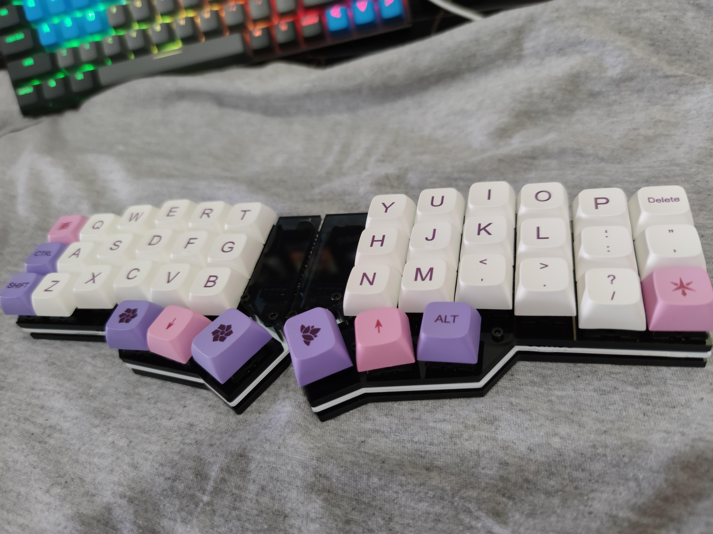

No começo da pandemia, passando um pouco mais de tempo no computador, comecei a notar um descoforto no braço direito e na lombar. Comecei a investigar o que poderia estar acontecendo, e notei que a mesa estava muito baixa. Comprei uma mais alta, e ainda aproveitei pra comprar uma cadeira melhor, pra fechar. Passada o tempo para me acostumar com o novo setup, notei que ainda sentia dores no braços, e uma dor no ombro apareceu. Foi aí que comecei a investigar soluções ergonômicas de teclados.

Foi aí que me perdi. Porque descobri que este assunto é extremamente extenso, e demandava algum tipo de aprofundamento, caso eu realmente quisesse tentar resolver problemas.

## PCB
## Switches
## Keycaps
## Componentes

